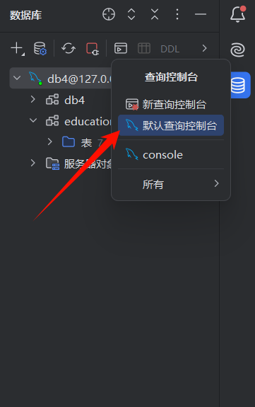
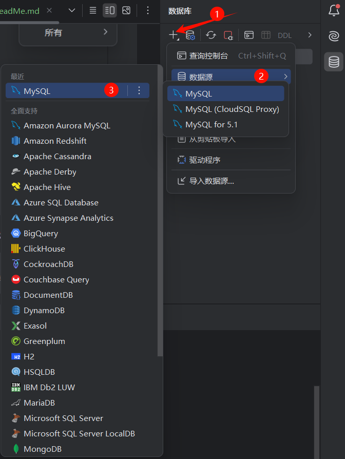
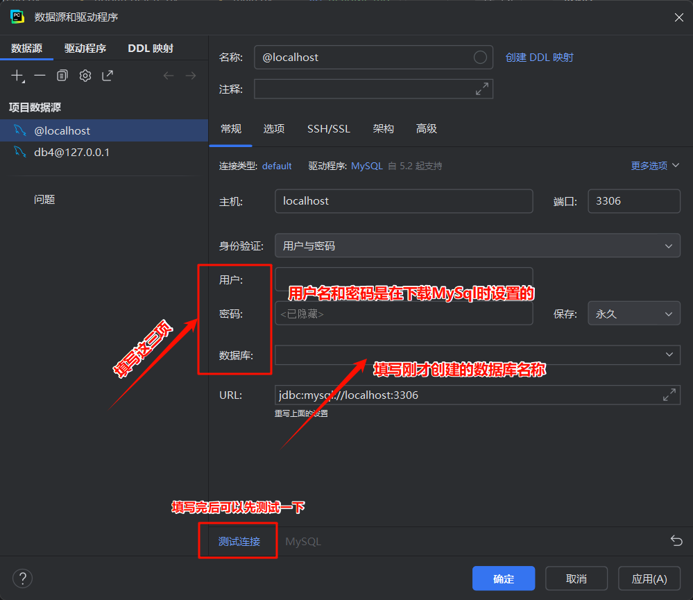

# 注意
运行代码前请先安装好MySql，建议使用 ***PyCharm专业版*** 

# 数据库配置

打开PyCharm专业版，点击最右边数据库打开控制台



输入以下命令创建数据库
```mysql
create database if not exists db4 
# 创建一个名称为db4的数据库（如果原来没有的话）
```
创建好之后点击数据源



按如下步骤操作



配置好后运行main文件即可

# 数据库关系

```
Exam
├── exam_id (主键)
├── exam_name
├── subject_name
├── total_score
└── exam_questions (关系: ExamQuestion)

ExamQuestion
├── eq_id (主键)
├── exam_id (外键, 关联 Exam)
├── question_id (外键, 关联 Question)
├── assigned_score
└── question (关系: Question)

Question
├── question_id (主键)
├── question_type
├── content
├── options (关系: QuestionOption)
├── knowledgepoints (关系: KnowledgePoint)
└── subject_id

QuestionOption
├── option_id (主键)
├── question_id (外键, 关联 Question)
├── content
├── is_correct

KnowledgePoint
├── point_id (主键)
├── question_id (外键, 关联 Question)
├── point_name
├── parent_point
├── level
└── question (关系: Question)
```

关系图说明：

* Exam 与 ExamQuestion 是一对多关系，一个试卷可以有多个题目。
* ExamQuestion 与 Question 是多对一关系，一个题目可以属于多个试卷。
* Question 与 QuestionOption 是一对多关系，一个题目可以有多个选项。
* Question 与 KnowledgePoint 是一对多关系，一个题目可以有多个知识点。
* KnowledgePoint 与 Question 是多对一关系，一个知识点属于一个题目。