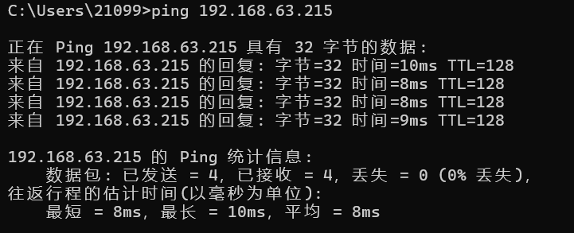

# 前端+后端+数据库 连接模型
通过实现一个 *任务清单* 的案例，构建 VUE、Python、MySQL三者连接框架

已实现同一局域网内不同设备的前后端连接

----

**注意**

create_aql.py文件里的数据库路径需要更改为自己的路径

# 简介
## 1.后端
后端通过 *fastapi* 框架生成链接地址实现与前端的连接

## 2.前端
前端通过调用后端发出的地址来进行操作（获取后端数据，给后端传值）

## 3.数据库
此次的数据库与 *education-sql* 目录下的数据库调用稍有不同

**front-end 目录** 使用的是 *SQLite 数据库* 通过 sqlite:/// 协议 连接到本地文件，数据库文件存储在本地磁盘上
SQLite 适用于小型项目、快速开发和测试，因为它是轻量级的，不需要单独的服务器进程，就相当于一个小插件，不需要单独下载，我在第一次使用时Pycharm就自动提示你下载

**education-sql 目录** 使用的是  *MySQL 数据库* 通过一个链接连接到本地主机（localhost）的 MySQL 服务，
MySQL 适用于大型项目和生产环境，因为它是一个功能更强大、更稳定的数据库系统，需要单独对他进行安装配置

**在此项目试例中两者可以互相切换**

---

# 运行方式

## 后端
直接运行 *app.py*

## 前端
可以使用 *cd 命令* 进入 *vue-font 目录* 或者用 *VScode* 打开 *vue-font 目录*

然后在控制台使用命令

    npm run dev

哦，对这个应该还需要配置一下，不然控制台应该识别不了 *npm* 我是在配置 Vue
时他自动就下载了npm

然后停止 vue 运行需要在控制台按 *复制键*

    Ctrl + C

---

# 同一局域网内不同设备的前后端连接

1.可以开启手机热点，分别让运行前后端的两个设备都连接该热点

2.打开 *cmd命令窗口* 输入

    ipconfig

回车运行，查看两台设备的 *IPV4* 地址

3.在其中一台设备（假设为前端设备）里的 *cmd命令窗口* 里输入

    ping 后端的IPV4地址

连接成功示意图

4.前端，即 *App.vue* 文件里  *Server_url* 的IP需要更改为 对应的后端的IPV4地址 
