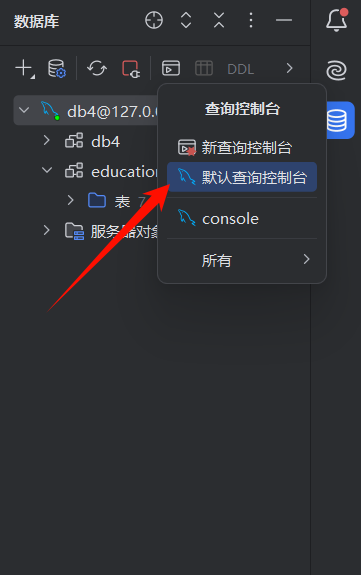
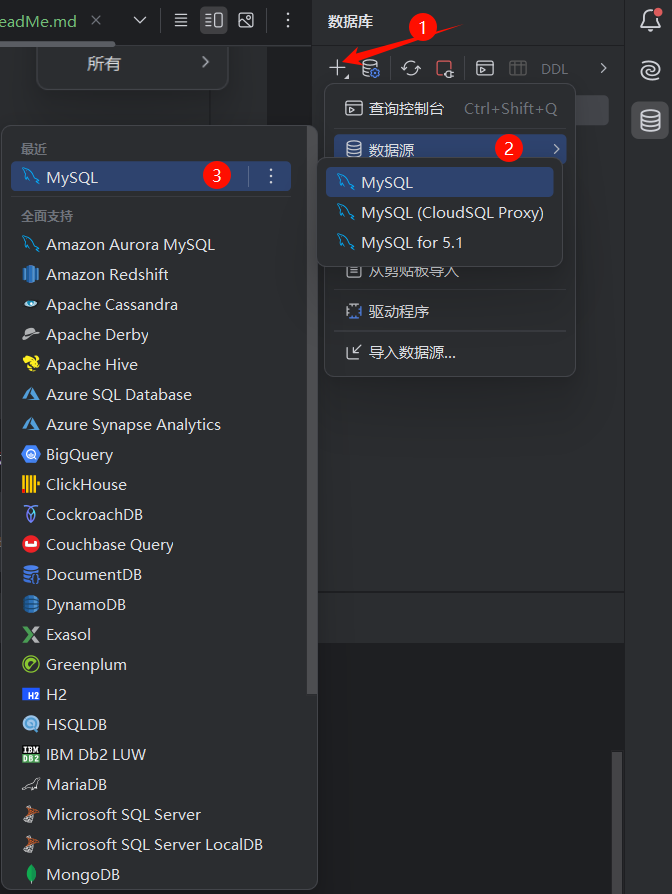

# 注意
运行代码前请先安装好MySql，建议使用 ***PyCharm专业版*** 

# 数据库配置

打开PyCharm专业版，点击最右边数据库打开控制台



输入以下命令创建数据库
```mysql
create database if not exists db4 
# 创建一个名称为db4的数据库（如果原来没有的话）
```
创建好之后点击数据源



按如下步骤操作


配置好后运行main文件即可

# 数据库关系

```
Subject
├── subject_id (主键)
├── subject_name
├── parent_id
├── exams (关系: Exam)
└── questions (关系: Question)

Exam
├── exam_id (主键)
├── exam_name
├── subject_id (外键, 关联 Subject)
├── total_score
├── time_limit
├── version
├── subject (关系: Subject)
├── exam_questions (关系: ExamQuestion)
└── subject_name (冗余字段)

Question
├── question_id (主键)
├── subject_id (外键, 关联 Subject)
├── question_type
├── content
├── explanation
├── difficulty
├── topic
├── meta_data
├── subject (关系: Subject)
├── options (关系: QuestionOption)
├── exam_links (关系: ExamQuestion)
├── knowledge_points (关系: KnowledgePoint)
└── original_type

ExamQuestion
├── eq_id (主键)
├── exam_id (外键, 关联 Exam)
├── question_id (外键, 关联 Question)
├── display_number
├── assigned_score
├── sort_order
├── exam (关系: Exam)
└── question (关系: Question)

QuestionOption
├── option_id (主键)
├── question_id (外键, 关联 Question)
├── option_key
├── option_content
├── is_correct
├── sort_order
└── question (关系: Question)

KnowledgePoint
├── point_id (主键)
├── question_id (外键, 关联 Question)
├── point_name
├── subject_id (外键, 关联 Subject)
├── parent_point
├── level
└── question (关系: Question)

```

关系图说明：

* Subject 与 Exam 是一对多关系，一个学科可以有多个试卷。
* Subject 与 Question 是一对多关系，一个学科可以有多个题目。
* Exam 与 ExamQuestion 是一对多关系，一个试卷可以有多个试卷-题目关系。
* Question 与 ExamQuestion 是一对多关系，一个题目可以出现在多个试卷中。
* Question 与 QuestionOption 是一对多关系，一个题目可以有多个选项。
* Question 与 KnowledgePoint 是一对多关系，一个题目可以有多个知识点。
* KnowledgePoint 与 Subject 是多对一关系，一个知识点属于一个学科。